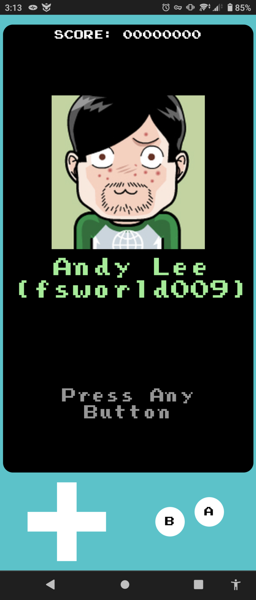
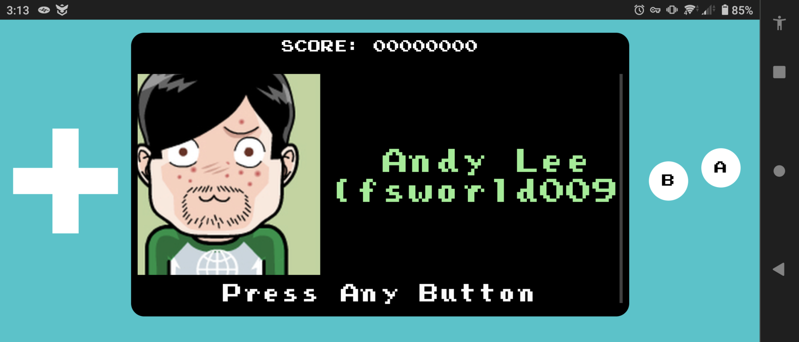

# fsworld009's Portfolio Page

This is my customized Portfolio Homepage hosted on GitHub pages, with
handheld game console theme.

The site is built with Vue (Nuxt.js, for static site rendering).

## Responsiveness

The website supports responsiveness with a twist. If the device is in portrait
mode, the frame is rendered as if you are holding a Nintendo GameBoy:



When in Landscape mode, the frame is more resemble to a Nintendo GameBoy
Advance:




## Handheld Game Console Theme

The Dpad and buttons can be used to navigate the website. They are clickable,
and can be controlled by keyboard as well. Optionally, you can browse the
website with only mouse or finger touch like other websites.

The goal of this Portfolio page is to highlight my characteristics:
a professional software developer and a hobby gamer.


## Dependencies

- [NuxtJS](https://nuxtjs.org/) with TypeScript
- [Pinia](https://pinia.esm.dev/)
  a Vuex alternative with better TypeScript support
- [Font Awesome 4.7](https://fontawesome.com/v4.7/) for icons
- [normalize.css](https://github.com/necolas/normalize.css/)
- [less.js](https://lesscss.org/) as CSS Preprocessor
- [Press Start Font](https://www.1001fonts.com/press-start-font.html)
  The main font of the website, resembles fonts you see in retro games

## Development

### Dev Server

```bash
npm run build_projects
npm run dev
```

Open dev server at https://localhost:3000.
hot reload is supported thanks to Nuxt.js


### Add a new project

1. Update `src/projects/index.json`
2. Create `src/projects/{project_id}.json`
3. Add screenshots to `src/static/screenshots/{project_id}`
4. Run `npm run build_projects`
5. Test the new page with `npm run dev`
6. Build and deploy

### Nuxt.js

Read [Nuxt Readme](Nuxt_README.md) for more details

## Build

```bash
# This will generate the entire website at dist/
npm run build
# Test the build
npm run test_dist
```

Open https://localhost:4000 to verify the build

## Deploy

```bash
npm run deploy
```
